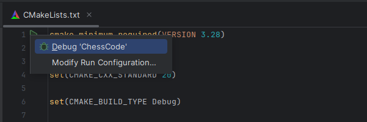
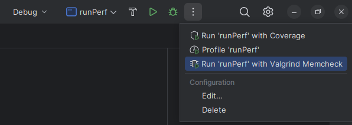
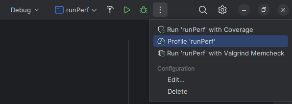

# ChessCode

ChessCode est un moteur d'échecs écrit en C++ qui permet de jouer contre un bot ou contre un autre joueur. Il utilise un algorithme minimax avec élagage alpha-bêta et Zobrist hashing pour l'optimisation de la recherche de coups.

## Prérequis

- **CMake** (version 3.29 ou supérieure) : Utilisé pour la configuration du projet.
- **Compilateur C++** (supportant C++20 minimum) : Le code utilise des fonctionnalités de C++20, assurez-vous que votre compilateur prend en charge cette version.

## Étapes pour compiler le projet

1. Clonez le dépôt :
   ```bash
   git clone https://github.com/Thibautau/ChessCode.git
   cd ChessCode
   ```
   
2. Créer le build en allant dans CMakeLists.txt et executez le pour préparer le projet



   Sinon, vous pouvez le faire en ligne de commande comme suit :Créez un répertoire de construction (build) :
      ```bash
      mkdir build
      cd build
      ```
   Exécutez CMake pour configurer le projet :
      ```bash
      cmake ..
      ```
   Enregistrez et Compilez le projet :
      ```bash
      cmake --build .
      ```

### Exécution

Une fois le projet compilé, vous pouvez exécuter le programme principal ou les tests ou un GUI:

- **Exécuter le jeu d'échecs** :
  ```bash
  ./ChessCode
  ```

- **Exécuter les tests** :
  ```bash
  ./runTests
  ```

- **Exécuter les tests de performance** :
  ```bash
  ./runPerf
  ```


## Mettre en place un profiler et un analyseur de fuites mémoires

### Si vous êtes sur Ubuntu (100% FONCTIONNEL)

1. Analyseur de mémoire ([Valgrind](https://www.jetbrains.com/help/clion/memory-profiling-with-valgrind.html)) :
   - Allez à la racine :
     ```bash
     cd
     ```
     - Mettez à jour les dépôts :
     ```bash
     sudo apt update
     ```
   - Installez Valgrind :
     ```bash
     sudo apt install valgrind
     ```
     
Et c'est fait, vous n'avez plus qu'à lancer le code avec valgrind




2. Profiler ([Perf](https://www.jetbrains.com/help/clion/cpu-profiler.html#export-import-profiler-results)) :
   - Mettez-vous à jour :
        ```bash
        sudo apt-get install
        ```
     - Donner des droits d'accès (Attention, cela affecte tout l'OS. Allez voir la [doc](https://www.jetbrains.com/help/clion/cpu-profiler.html#export-import-profiler-results) pour gérer vous même si ça ne vous convient pas) :
        ```bash
        sudo sh -c 'echo 1 >/proc/sys/kernel/perf_event_paranoid'
        sudo sh -c 'echo 0 >/proc/sys/kernel/kptr_restrict'
        ```

Tout est bon, il ne reste plus qu'à lancer le programme avec le profiler



### Si vous êtes sur Windows (NE FONCTIONNE PAS POUR LE MOMENT !!!!)

#### Installation d'Ubuntu sur WSL2

1. Installez WSL2 si ce n'est pas déjà fait :
   ```bash
   wsl --install
   ```

2. Lancez Ubuntu depuis le menu Démarrer ou avec cette commande :
   ```bash
   wsl
   ```

3. Installez les outils requis sous Ubuntu :
    - Mettez à jour les dépôts :
      ```bash
      sudo apt update
      ```
    - Installez Valgrind :
      ```bash
      sudo apt install valgrind
      ```
    - Installez CMake si ce n'est pas fait :
      ```bash
      sudo apt install cmake
      cmake --version
      ```
    - Vérifiez l'installation de Valgrind :
      ```bash
      valgrind --version
      ```

#### Configuration d'un serveur GDB pour le débogage

1. Téléchargez et exécutez le script de configuration :
   ```bash
   wget https://raw.githubusercontent.com/JetBrains/clion-wsl/master/ubuntu_setup_env.sh && bash ubuntu_setup_env.sh
   ```

2. Installez et configurez le serveur SSH :
   ```bash
   sudo apt update && sudo apt install openssh-server
   ```

3. Relancer le serveur :
   ```bash
   sudo systemctl restart ssh
   ```

4. Connectez-vous via SSH :
   ```bash
   ssh user@localhost -p 2222
   ```
   
5. En cas de problème de connection, faites ceci:
   ```bash
   sudo nano /etc/ssh/sshd_config
   ```
   Et mettre dedans:
   ```
   Include /etc/ssh/sshd_config.d/*.conf
   
   Port 2222
   
   ListenAddress 127.0.0.1
   ```

6. Configurez CLion :
    - Allez dans **Settings > Build, Execution, Deployment > Toolchains**.
    - Créez une nouvelle Toolchain sous WSL (les informations devraient être remplies automatiquement).
      - Configurez Valgrind dans **Settings > Build, Execution, Deployment > Dynamic Analysis Tools** :
          - Chemin : 
            ```
            \\wsl$\Ubuntu\usr\bin\valgrind
            ```
          - Options :
            ```bash
            --leak-check=full --leak-resolution=med --track-origins=yes --vgdb=no
            ```
      - Dans  **Settings > Build, Execution, Deployment > Cmake** changez la toolchain pour WSL


#### Configuration de perf

1. Installez les dépendances requises :
   ```bash
   sudo apt update
   ```
   ```bash
   sudo apt install flex bison
   ```
   ```bash
   sudo apt install libdwarf-dev libelf-dev libnuma-dev libunwind-dev \
   libnewt-dev libdwarf++0 libelf++0 libdw-dev libbfb0-dev \
   systemtap-sdt-dev libssl-dev libperl-dev python-dev-is-python3 \
   binutils-dev libiberty-dev libzstd-dev libcap-dev libbabeltrace-dev
   ```

2. Clonez et compilez `perf` :
   ```bash
   git clone https://github.com/microsoft/WSL2-Linux-Kernel --depth 1
   ```
   ```bash
   cd WSL2-Linux-Kernel/tools/perf
   ```
   ```bash
   make -j8 # parallel build
   ```
   ```bash
   sudo cp perf /usr/local/bin
   ```

3. En cas d'erreur de compilation :
   ```bash
   sudo apt install libpfm4-dev libtraceevent-dev pkg-config
   ```

#### CLion Installation

1. Allez dans **Settings > Build, Execution, Deployment > Dynamic Analysis Tools > Profiler**.
2. Dans `perf executable`, configurez le chemin suivant :
   ```
   \wsl$\Ubuntu\usr\local\bin\perf
   ```
3. Laissez les autres paramètres par défaut.


## Disclaimer
Le bot est toujours en cours de développement, et des fonctionnalités sont encore en phase de test.

Bon jeu à vous!