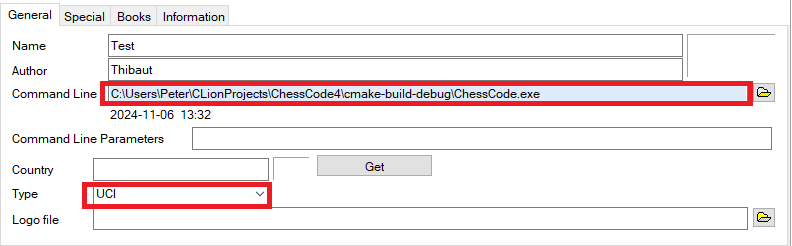

# ChessCode

ChessCode est un moteur d'échecs écrit en C++ qui permet de jouer contre un bot ou contre un autre joueur. Il utilise un algorithme minimax avec élagage alpha-bêta et Zobrist hashing pour l'optimisation de la recherche de coups.

## Prérequis

- **CMake** (version 3.29 ou supérieure) : Utilisé pour la configuration du projet.
- **Compilateur C++** (supportant C++20 minimum) : Le code utilise des fonctionnalités de C++20, assurez-vous que votre compilateur prend en charge cette version.
- **GoogleTest** : Utilisé pour les tests unitaires (normalement intégré au fichier de config cmake du projet)
- **WSL2 (pour les tests de perf)** (Windows Subsystem for Linux 2) pour les utilisateurs Windows qui souhaitent utiliser Linux sous Windows.

## Compilation

### Étapes pour compiler le projet

1. Clonez le dépôt :
   ```bash
   git clone https://github.com/Thibautau/ChessCode.git
   cd ChessCode
   ```

2. Créez un répertoire de construction (build) :
   ```bash
   mkdir build
   cd build
   ```

3. Exécutez CMake pour configurer le projet :
   ```bash
   cmake ..
   ```

4. Enregistrez et Compilez le projet :
   ```bash
   cmake --build .
   ```

### Exécution

Une fois le projet compilé, vous pouvez exécuter le programme principal ou les tests :

- **Exécuter le jeu d'échecs** :
  ```bash
  ./ChessCode
  ```

- **Exécuter les tests** :
  ```bash
  ./runTests
  ```

- **Exécuter les tests de performance** :
  ```bash
  ./runPerf
  ```

## Configuration pour UCI (Universal Chess Interface)

Par défaut, le jeu est jouable depuis la console. Cependant, pour le relier à un logiciel d'interface graphique (GUI) utilisant le protocole UCI, vous devez suivre les étapes suivantes :

1. Dans le fichier `main.cpp`, décommentez la ligne suivante :
   ```cpp
   /*UCI* uci = new UCI();
   uci->uciCommunication();*/
   ```
   et commentez la ligne suivante :
   ```cpp
   game->playTurn();
   ```

2. Compilez le programme :
   ```bash
   cmake --build .
   ```

3. Une fois la compilation terminée, renseignez l'exécutable ChessCode du programme dans votre logiciel GUI, en vous assurant que le protocole UCI est bien activé pour l'échange de données.

   

Le bot devrait désormais être opérationnel dans votre interface graphique.


### Installation d'Ubuntu sur WSL2

1. Installez WSL2 si ce n'est pas déjà fait :
   ```bash
   wsl --install
   ```

2. Lancez Ubuntu depuis le menu Démarrer ou avec cette commande :
   ```bash
   wsl
   ```

3. Installez les outils requis sous Ubuntu :
    - Mettez à jour les dépôts :
      ```bash
      sudo apt update
      ```
    - Installez Valgrind :
      ```bash
      sudo apt install valgrind
      ```
    - Installez CMake si ce n'est pas fait :
      ```bash
      sudo apt install cmake
      cmake --version
      ```
    - Vérifiez l'installation de Valgrind :
      ```bash
      valgrind --version
      ```

### Configuration d'un serveur GDB pour le débogage

1. Téléchargez et exécutez le script de configuration :
   ```bash
   wget https://raw.githubusercontent.com/JetBrains/clion-wsl/master/ubuntu_setup_env.sh && bash ubuntu_setup_env.sh
   ```

2. Connectez-vous via SSH :
   ```bash
   ssh user@localhost -p 2222
   ```

3. Configurez CLion :
    - Allez dans **Settings > Build, Execution, Deployment > Toolchains**.
    - Créez une nouvelle Toolchain sous WSL (les informations devraient être remplies automatiquement).
    - Configurez Valgrind dans **Settings > Build, Execution, Deployment > Dynamic Analysis Tools** :
        - Chemin : `\\wsl$\Ubuntu\usr\bin\valgrind`
        - Options :
          ```bash
          --leak-check=full --leak-resolution=med --track-origins=yes --vgdb=no
          ```

## Disclaimer
Le bot est toujours en cours de développement, et des fonctionnalités sont encore en phase de test. Suite à un récent merge de la branche UCI, la structure du code a été modifiée, ce qui peut entraîner certains bugs.

L'implémentation UCI n'est pas encore complète et peut causer des plantages dans certains GUI. En cas de plantage, il est recommandé de relancer l'application GUI. Si une partie reste bloquée lors du lancement d'un nouveau jeu, redémarrez simplement l’interface graphique.